# 2C (SE) - Software Engineering - Notes

## 18 September 2018

### Software Engineering Activities

1. Requirements Capture
2. Design
3. Construction/Implementation
4. Testing & Debugging
5. Maintenance/Evolution

## 4 October 2018

### Identifying Classes and Operations

- Identifying Classes

  - Ignore all non-nouns and instead focus on the *nouns* in the *project description*.

- Identifying Operations

- Focus on *verbs* instead.

**In both cases, use your judgement again to eliminate some concepts for further simplicity and clarity.**

**Beware of subclassing/inheritance relationships between classes (or of its concepts).**



## 18 October 2018

### Software Configuration Management

- Version Control
- Compiling  (and *Building* as a general idea)

### Version Control

- Lock-Modify-Unlock Model *[OLD]*

  - Advantages

    - Very simple.
    - Central source of truth.

  - Disadvantages

    - Multiple developers cannot work on the same file.
    - Deadlocks might occur (especially if scripts are doing some maintenance work on the repo for instance, say linting multiple files).
    - Requires access to repo at all times (*e.g.* you cannot checkout a file to modify it during the holiday, lest it will be inaccessible for a week).

- Copy-Modify-Merge *[NEW]*

  - Advantages

    - Multiple developers can work on the same file at the same time.
    - Deadlocks cannot occur since there is no locking.
    - Distributed repositories might be beneficial for certain development. models (*i.e.* open-source projects where every contributor might want to have a full-access).
    - Does not require access to repo at all times.

  - Disadvantages

    - More complicated than Lock-Modify-Unlock model.
    - Multiple sources of truth (though in reality there is often a master repo).
    - Merge conflicts happen, and they are not uncommon.
    - Automatic merging used to be faulty sometimes but software are getting better.
    - Not every file-type is *mergable*, such as photographs, PDF documents, audio files, or spreadsheets.
      - **Merging requires certain assumptions about the file semantics.**



- Three-Way Merge

- 1. Original File:

     ```
     Alpha
     Bravo
     Charlie
     ```

  2. Tester 1 edits the Original File:

     ```
     Alpha
     Foxtrott
     Charlie
     ```

  3. Tester 2 edits the Original File:

     ```
     Delta
     Alpha
     Echo
     Charlie
     ```

  4. Tester 2 commits changes.

  5. Tester 1's commit fails.

  6. Tester 1 updates and merge reports conflicts:

     ```
     Delta
     Alpha
     <<<<<< .mine
     Foxtrott
     ======
     Echo
     >>>>>> .r4
     Charlie
     ```

  7. Tester 1 now has to choose whether to retain her or Tester 2’s version.

### Compiling and Building

- C

  - Make *[OLD]*
  - CMake *[NEW]*

- Java

  - Ant *[OLD]*
  - Maven *[NEW]*

## 23 October 2018

### Refactoring

- **As code evolves its quality naturally decays.**

  - Because **changes are often local, without full understanding of the context.**

- **Refactoring**, is about restoring good design in a *disciplined way*.

  - There are **refactoring patterns**.
    - There are patterns for everything in Software Engineering...

- *Refactoring is changing __internal__ structure of software to make it:*

  - *easier to understand, and*
  - *cheaper to modify*

  _**without changing its observable behaviour.**_

- Refactoring was once seen as a kind of maintenance, but it can also be an integral part of the development process!

  - Agile methodologies (*e.g.* XP) advocate continual refactoring.

- **A refactoring is a _small_ transformation.**

  - Do NOT confuse it with **rewrite**.

- To ensure that refactoring hasn’t **changed**/broken something?

  - *test, refactor, test*

### Bad Code Smells

- Duplicated code
- Long methods
- Large classes
- Long parameter lists
- Lazy classes
  *i.e.* Classes that are ridiculously small.
- Long message chains
  *i.e.* Having too many (unnecessary) indirections.

## 25 October 2018

### Verification, Validation, and Testing (VV&T)

- **VV&T** generally refers to all techniques for improving **product quality**.
- **Verification:** are we building the software *right*?
  - Does software meet requirements?
  - *Static analysis, reviews, inspections, walk-throughs*
- **Validation:** are we building the *right software*?
  - Does software accommodate customers' needs?
  - *Prototyping, early releases*
  - Validation is more general than verification.
- **Testing is a useful technique for both.**

### Testing

- In essence, testing is
  - *Generating stimulus* for a component
  - *Collecting outputs* from the component
  - *Checking* if *actual* outputs are as *expected*
- __Automation of tests is essential.__
  - Speeds up the whole testing process.
  - **Makes tests deterministic.**
    - Not necessarily always, but definitely more deterministic than a human being.
- `assert` statements are common to compare the actual results and expectations.
  - **Checks can also be spread throughout the program code itself.**

#### Kinds of Tests

* Testing approaches:
  * **Black-Box Testing**
    purely specification-based (treating the component as a "black box")
  * **White-Box Testing**
    also considers the internal structure
* Kinds of tests:
  * **Module (or Unit) Tests**
    for each class in OO software
  * **Integration Tests**
    test components interact properly
  * **System Tests**
    check if functional and non-functional requirements met, *verification*
  * **Acceptance Tests**
    in customer environment, *validation*
  * **Stress Tests**
    look for graceful degradation, not catastrophe
  * **Performance Tests**
    performance is often a non-functional requirements (*e.g.* in real-time systems)
  * **Regression Tests**
    more like a testing methodology, repeated full-tests after each modification

#### How to Test

- Tests should be
  - **repeatable**
  - **documented**
    both the tests and the results
  - **precise**
  - **done on configuration-controlled software**
- **Ideally test spec should be written at the same time as the requirements spec.**
  - Tests and requirement features can be cross-referenced!
  - Use cases can suggest tests.
  - **Also helps to ensure *testability* of requirements.**

### Preconditions, Postconditions, Invariants

- **Method Precondition**
  A condition that must be true when a method is invoked.
- **Method Postcondition**
  A condition that the method guarantees to be true when it finishes.
- **Class Invariant**
  A condition that should *always* be true for all the instances of a given class.
  - *Always* as in all *client-visible* states, that is, whenever the object is not executing one of its methods!

#### Java Modelling Language (JML)

- JML provides

  - A richer language (predicate logic) for writing boolean conditions than Java boolean expressions (propositional logic), for example allowing *quantifiers* such as `\forall` and `\exists`.
  - Special comment syntax for common assertion types:
    - **Preconditions:** `//@ requires x > 0;`
    - **Postconditions:** `//@ ensures \result % 2 == 0;`
    - **Invariants:** `//@invariant name.length <= 8; `
    - **General assertions:** `//@ assert i + j = 12;`

- Examples:

  - ```java
    //@ requires x >= 0.0
    /*@ ensures JMLDouble
      @         .approximatelyEqualTo
      @        (x, \result * \result, eps);
      @*/
    public static double sqrt(double x) {
        /*...*/
    }
    ```
  - ```java
    /*@ requires a != null
      @       && (\forall int i;
      @               0 < i && i < a.length;
      @               a[i-1] <= a[i]);
      @*/
    int binarySearch(int[] a, int x) {
        // ...
    }
    ```
    - > Note that this universally quantified expression in JML must have parentheses around it, `(\forall ... )`.

    - > The range is optional, but if omitted, such a universally quantified expression may not be executable; it can still be used for documentation purposes, however.

- > In return for the benefit of faster understanding, modular reasoning imposes a cost. This cost is that clients are not allowed to conclude anything that is not justified by the contracts of the methods that they call. Another way of looking at this is that, to allow modular reasoning with contract specifications, **the client code must work for every implementation that satisfies the contract.**

  - > Otherwise, the implementation would no longer be free to change the algorithm used.

- >  There are other good reasons not to use code as contracts. **Code makes a poor contract, because by only using code one cannot convey to readers what is intended (i.e., what the *essential properties* of the method are) and what parts are merely implementation decisions (*accidental features*).**

  - > For example, if the code for `sqrt` computes square roots to 7 decimal places, cannot this be changed in the next release? Without some separate description of what is intended, the reader can’t tell if that 7 decimal places were intended, or just happened to be computed; perhaps 4 decimal places are all that is necessary for the rest of the program.

- Some tools such as *jmlc, jmlrac, etc.* compile and run JML-annotated Java code into bytecode with specific **runtime assertion checking**.
- __Assertions can also be used on *inputs* to *constrain* the *random generation of input data*.__

  - QuickCheck!

*Quotes from:* http://www.eecs.ucf.edu/~leavens/JML//jmldbc.pdf

### Kinds of Bugs

- In order of increasing severity:

  1. **Mistake**
     A human action that produces a fault.
  2. **Fault (Defect)**
     An incorrect step, process, or data definition in a computer program.
  3. **Error**
     A difference between some computed value and the correct value.
  4. **Failure**
     The software (or whole system) failing to deliver some service it is expected to deliver.

  - **Faults do not necessarily lead to errors.**
  - **Errors do not necessarily lead to failures.**

### Test-First Development

- **Motivation:** Tests implicitly define...

  - interface, and
  - **specification of behaviour**

  for the functionality being developed.

  - **Writing tests first often clarifies requirements!**
    - Testing code demands more precision than an English specification.

- **Idea** is

  - write tests **before** writing the code they apply to,
  - run tests as code is written.
  - *In an ideal world, the system will be complete when all your tests pass. :)*
  - **TFD avoids poor ambiguity resolution.**
    - Instead of choosing what is easiest to implement in the face of ambiguity, you will implement the right thing (that your tests check for).

- **Consequently**

  - bugs found at earliest possible point of development
  - locating bugs are relatively easy (due to locality of tests)
  - **TFD ensures adequate time for test writing.**
    - Often testing time is squeezed or eliminated.

### Test-Driven Development

- A subtly different term, covers the way that in Extreme Programming detailed tests *replace* a written specification.

### Limitations of Testing

- **Writing tests is time-consuming**

- **Coverage almost always limited**
  may happen not to exercise a bug.

- **Difficult/impossible to emulate live environment perfectly**
  *e.g.* *race conditions* that appear under real load conditions can be hard to find by testing.

- **Can only test executable things**
  mainly code, or certain kinds of model – not high level design or requirements.

### Reviews, Walkthroughs, Inspections

- 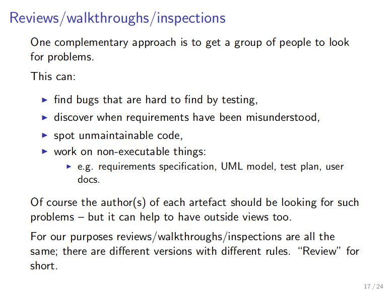
- 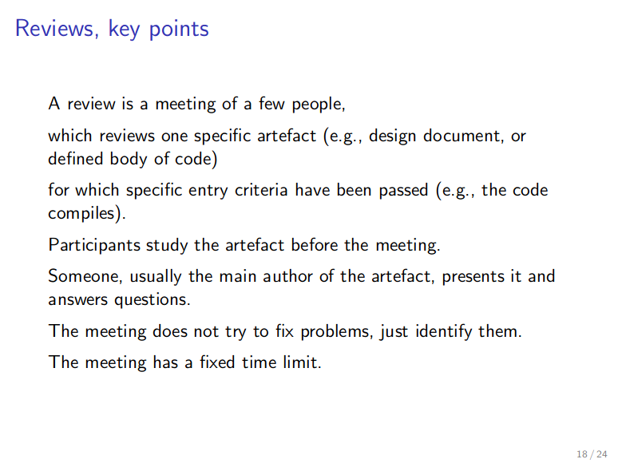

### Static Analysis

- Static analysis is **the inspection of the code to determine properties of it *without running it*.**
  - When contrasted with testing, testing is called *dynamic testing*.
- **Type-checking** during compilation is a basic kind of static analysis.
- **Trade-offs**
  - As the properties checked get more complicated,
    - only smaller programs can be analysed.
    - the process is less automated (*e.g.* **annotations** required).
  - As tools are more automated and designed to work on larger programs, they often *cannot*
    - guarantee every problem flagged is a real error (*i.e.* false-positives)
    - find every error (*i.e.* false-negatives).
  - The latter kind of tools are more to aid bug-hunting than ensuring *correctness*.

## 1 November 2018

### Deployment

- Getting software out of the hands of the developers into the hands of the users.
- More than 50% of commissioned software is not used, mostly because it fails at deployment stage.

#### Key Issues

- **Business processes**
  Most large software systems require the customer to change the way they work; has this been properly thought through?
- **Training**
- **Deployment itself**
  How *physically* to get the software installed.
- **Equipment**
  Is the customers' hardware up to the job?
- **Expertise**
  Does the customer have the IT expertise to install & use the software?
- **Integration**
  How will the software integrate with other systems of the customers'?

- "Installing" is the easiest part of deployment...

 ### Maintenance

The process of *changing a system after it has been delivered*.

- **Fixing bugs and vulnerabilities**
  not only in code, but also design and requirements
- **Adapting to new platforms and software environments**
  *e.g.* new hardware, new OSes, new software/systems to integrate...
- **Supporting new features and requirements**
  necessary as operating environments change in response to competitive pressures.

#### Challanges

- **(Un)popularity of maintenance work:**
  - Unpopular -- seen as less skilled, can (and often does) involve obsolete languages.
- Often a new team has to understand the software.
- **Development and maintenance often separate business contracts.**
- Things often degrade over time.
- Working with obsolete compilers, OSes, hardware...

### Re-engineering

- **Source code translation**
  *E.g.* from obsolete language, or assembly, to modern language, ...
- **Reverse engineering**
  *I.e.* analysing the program, possibly in the absence of source code!
- **Structure improvement**
  Especially modularisation, architectural refactoring, ...
- **Data re-engineering**
  Reformatting and cleaning up data.
- **Adding adaptor interfaces <3** 
  to users and newer other software

#### Issues

- Specification might be lost as well...
- Which bugs do you deliberately preserve?

### Bug Reporting

- Many projects use a *bug tracking system* for both bug reports and new feature requests.
- These provide extensive support for *receiving*, *tracking*, notifying, monitoring, *etc.*
- Each *ticket* has a
  - unique **ticket number**
  - **summary**
  - **component** where the bug is observed
    (it might not always be clear; sometimes bugs arise out of integration issues)
  - **version** of the program 
  - **milestone** in which this bug is aimed to be fixed
  - **type**
    *e.g.* *defect*, or maybe *enhancement* for feature requests!
  - **owner**
    *i.e.* the creator of the ticket
  - **assignee**
    *i.e.* the person responsible for the resolution of the ticket
  - **status**
    *new*, *assigned*, *notabug* if the developers think it's not a bug, *resolved*, ...
  - **priority**
    some bugs and/or feature requests are more important than others!
  - and much more!

- When **reporting bugs**:
  - Include tediously detailed information about
    - what *exactly* you did
      - so that bug can be *reproduced*
    - what did you expect to happen
    - what happened instead
  - Include full information about the system & environment such as
    - operating system
    - hardware (processor, graphics card, ...)
  - Make an intelligent attempt at diagnosing the problem if you can.
    - Keep your *diagnosis* completely separate from the report of *what happened*.
  - Add a concise summary at the beginning.
  - Do **not** omit information you think is irrelevant; you are probably wrong in what you think.

## 8 November 2018

### Software Processes

- A process is *"a set of activities and way of organising/coordinating those activities in order to produce a software system."*
- **Activities:**
  - **Software Specification**
    goals, functionality, and constraints
  - **Software Development**
    producing software: design, construction, verification
  - **Software Validation**
    ensuring that software accommodates the customers' needs
  - **Software Evolution**
    adapting software to changing needs and requirements
- Processes are about *management*:
  - ordering activities
  - outcomes of activities
  - allocating people and resources
  - planning in advance, predicting time/cost/resource usage
  - **monitoring**
  - **risk reduction**
- **Process models** are *ideals*, in practice mix and match!

#### Waterfall Model

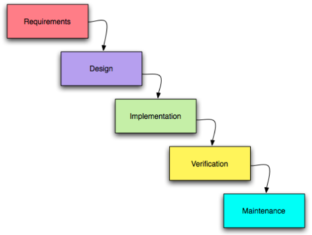

**Pros:**

- Better than no process at all, makes clear that requirements must be analysed, software must be tested, *etc.*
- Suitable for
  - very slowly evolving systems where high-reliability, safety *etc.* are top priorities (*e.g.* engine control unit of a car), in other words, **safety-critical**
  - for **embedded systems** where resources are extremely limited and deployment is often only once (during flashing!),
  - very **large systems** where the interaction between multiple components must be clearly laid out (which also allows simultaneous development of different components).

**Cons:**

- Inflexible and unrealistic: *e.g.* verification will show up problems with requirements capture.
  - Many real-world application (need to) evolve rapidly in response to the changing customer needs and competitive market conditions.
- Slow and expensive: in an attempt to avoid problems later, we end up "gold plating" early phases.
  - *E.g.* Over-engineering at Requirements and Design stage so to avoid problems during implementation and verification.

#### Spiral Model

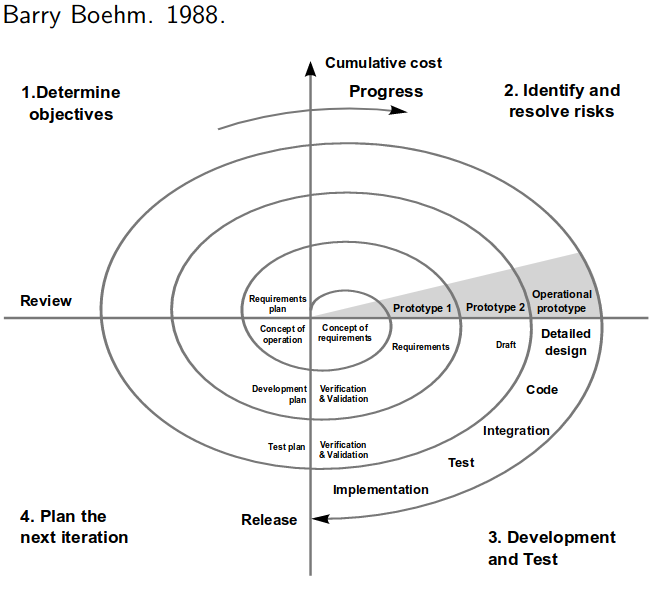

- **Cycles** are an essential concept:
  1. Determine **Objectives**
     objectives are settled 
  2. Identify and Resolve **Risks**
     risks identified, alternatives considered (*e.g.* go for prototype to analyse uncertain requirements)
  3. **Development and Test**
  4. **Review** for the next iteration
     project reviewed and decisions made about continuing
- **A key innovation is prominent role of risk.**


**Pros:**

- Risk plays a prominent role, which is crucial.
- Iterative approach is more suitable (than the Waterfall) to real-world.
- Steps are clearly identified.

**Cons:**

- Loops are still *sequential*, but in real-world it's more of a back-and-forth, and there is more concurrency (*e.g.* realising that a requirement has been misunderstood during development forces you to revise your requirements)
- Steps are not as elaborate as UP for instance; no guidelines on how to proceed with validation, with business modelling, and how the importance of each varies through the time...

#### Unified Process

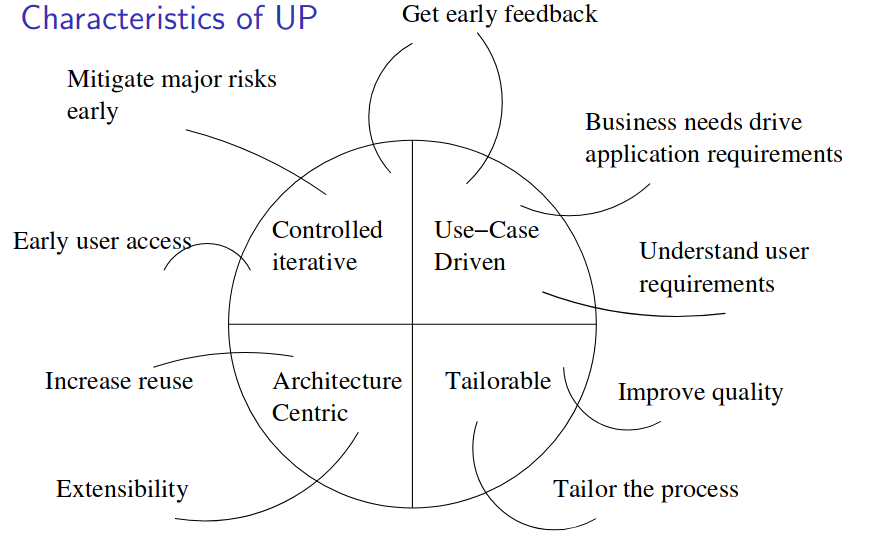

- Again, **cycles**:
  1. **Inception** ends with commitment from the *project sponsor* to go ahead:
     *business case* for the project and its basic feasibility & scope known
  2. **Elaboration** ends with
     - **basic architecture** of the system in place
     - a **plan for construction** agreed
     - all **significant risks identified**
  3. **Construction** (definitely **iterative**) ends with a beta-release system
  4. **Transition** is introducing the system to its users
- The process for a single product will have several *cycles*.
- **Each instance of a phase might have several iterations.**

##### Workflows

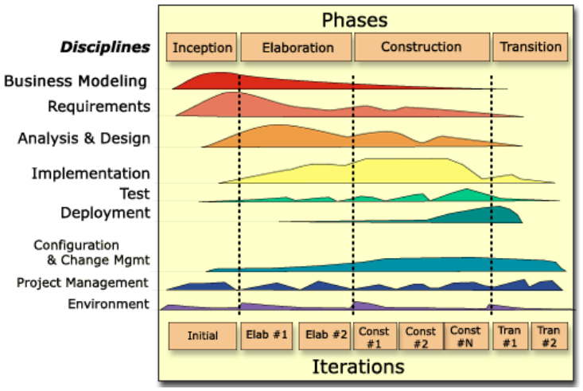

**6 Engineering workflows:**

1. **Business modelling** [Inception cycle]
   A key *pro* of UP is the fact that it includes the *business* side of software engineering into the software process itself. The fact that *business modelling* precedes *requirements* evidences that software is developed to serve a (business) purpose.
2. Requirements [Elaboration cycle]
3. Analysis and design [Elaboration cycle]
4. Implementation [Construction cycle]
5. Test [Construction cycle]
6. Deployment [Transition cycle]

**3 Supporting workflows:**
always ongoing workflows in the background

1. Configuration and change management
2. Project management
3. Environment (*e.g.* process and tools)


##### UP Best Practises

1. **Develop software iteratively**
2. **Manage requirements**
   document explicitly, analyse impact before adopting
3. **Use component-based architectures**
   promote systematic reuse
4. **Visually model software**
   UML...
5. **Verify software quality**
   testing, linting, coding standards
6. **Control change to software**
   configuration management

#### Personal Software Process

- UNIMPORTANT.

- **PSP provides a ladder of gradually more sophisticated practises.**
- The idea:
  1. Identify those (UP) large-system **software methods & practises that can be used by individuals**,
  2. Define a subset of those methods and practises that can be applied while developing **small programs**,
  3. Structure them so that they can **gradually introduced**,
  4. Provide **exercises suitable for practising** these methods in an educational setting.
- Lots of forms to fill in: time recording log, defect recording log, ...
- A relatively **high ceremony** process, aimed at **individuals and small projects**.
  - It's often used as a training for high(er) ceremony processes such as UP.

## 13 November 2018

### Agile Processes

- Software development has to be *agile*: **able to react quickly to change**
- **Maxims:**
  - **Individuals and interactions** over processes and tools
  - **Working software** over comprehensive documentation
  - **Customer collaboration** over contract negotiation
  - **Responding to change** over following a plan

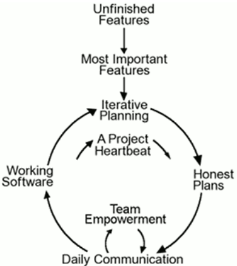

#### 12 Principles of Agile

1. **Customer satisfaction** by **rapid delivery** of **useful software**
2. **Welcome changing requirements**, even late in development
3. **Working software is delivered frequently (weeks rather than months)**
4. **Working software is the principal measure of progress**
5. **Sustainable development**, able to **maintain a constant pace**
6. **Close, daily co-operation between business people and developers**
7. Face-to-face conversation is the best form of communication (**co-location**)
8. Projects are built around motivated **individuals, who should be given right support and trusted to get job done**
9. **Continuous attention** to technical excellence and good design
10. **Simplicity is essential**
11. Best requirements and designs form **self-organising teams**
12. **Regular reflection** on process and tuning of behaviour

### Extreme Programming (XP)

- **EXTREME PROGRAMMING IS AN AGILE VARIANT.**

  - Other Agile processes include Scrum and DSDM.

  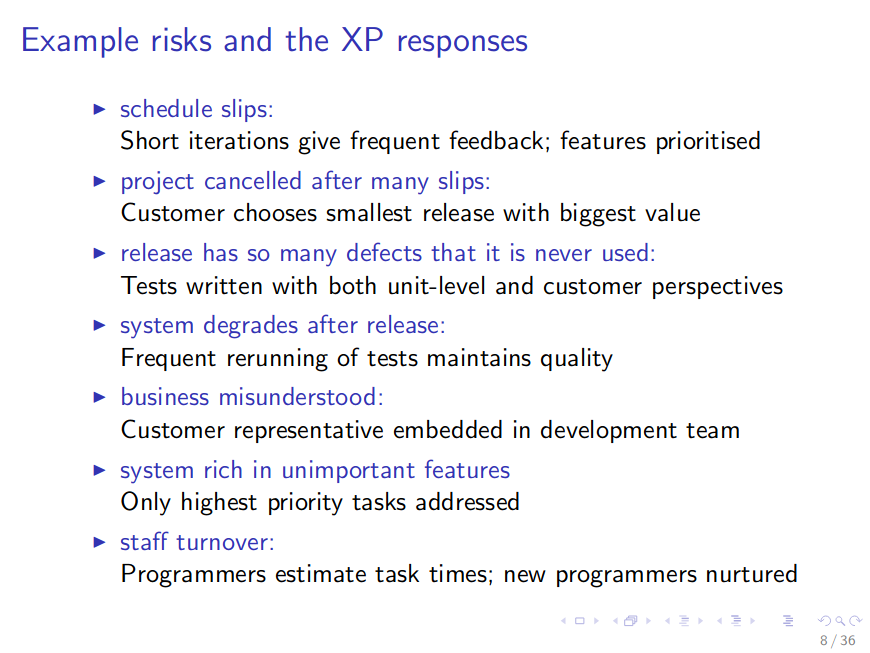

- **Activities**

  - **Listening**
    understanding the customer, communicating efficiently
  - **Designing**
    creating structure, organising system logic
  - **Coding**
  - **Testing**
    *embodying requirements*, assessing quality, guiding coding


##### XP Practices - Planning Game

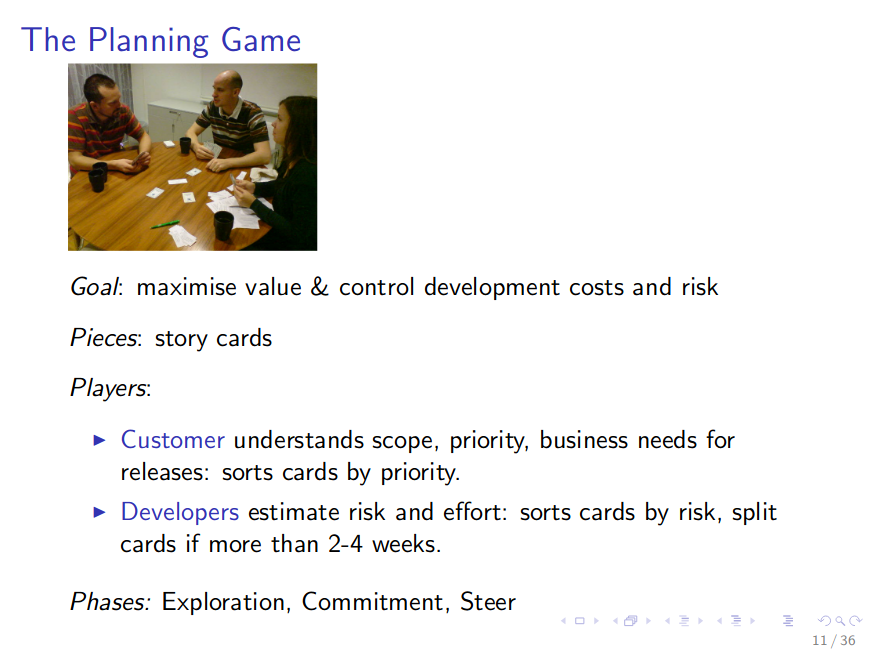

##### XP Practices - On-Site Customer

- Someone capable of making the business's decisions in the planning game, a representative of the customer who sits with the development team, being always ready to
  - clarify
  - (help) write functional tests
  - make small-scale priority and scope decisions
- Customer can do their *normal work* when not needed to interact with the development team.


##### XP Practices - Small Releases

- **Release as frequently as is possible whilst still adding some *business value* in each release.**
  - **You get feedback as soon as possible.**
  - **Lets the customer have the most essential functionality ASAP.**
- Every week or every month.
- Outside XP releases commonly every 6 months or longer.


##### XP Practices - Methaphors

- About an easily-communicated overarching view of the system.
- **Encompasses concept of software architecture.**
- **Eases the developer-customer communication.**
- Provides a sense of cohesion.
- **Often suggests a consistent vocabulary.**


##### XP Practices - Continuous Integration

- **Code is integrated, debugged, and tested in full system build frequently** (at most a few hours or a day after being written).
- **Maintains a working system at all times.**
- **Makes bugs easier to trace.**
  - "It was alright an hour ago! Let me check what has changed since then."
- **Simplifies integration, prevents late-stage surprises.**


##### XP Practices - Testing

- **Any program feature without an automated test simply doesn't exist.**
- **Tests are the contract between your developers, and between you and your customers.**
  - Programmers write **unit tests**.
  - Customers (with your help) write **functional tests**.


##### XP Practices - Refactoring

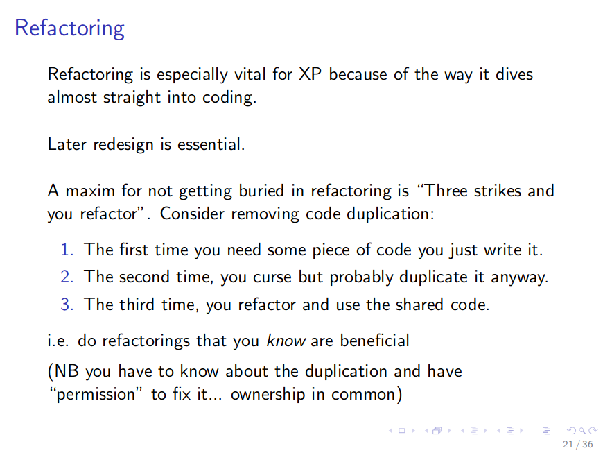

##### XP Practices - Pair Programming

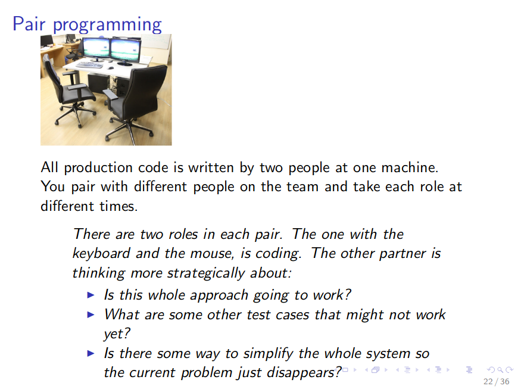

##### XP Practices - Collective Ownership

- **Every developer is responsible for the codebase as a whole**, and is permitted to modify and improve as they seem fit.


##### XP Practices - Coding Standards

- **The whole team adheres to a single set of *conventions* about how code is written.**
  - **In order to make *pair programming* and *collective ownership* work.**


##### Mixing and Matching XP Practices

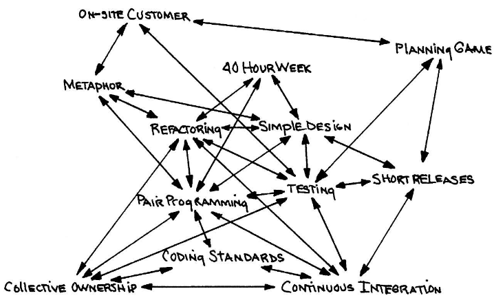

- XP practices are *very* interrelated & interdependent so it's dangerous:
  - *Collective Ownership* without *Coding Standards* will create an inconsistent mess.
  - *Simple Design* without *Refactoring* will create code smell.
  - *Planning Game* without *On-Site Customer* is simply unimaginable!

### Comparison of Different Processes

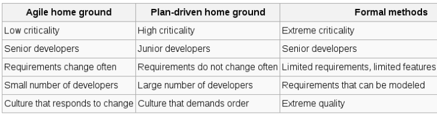

- **Formal Methods** go beyond Waterfall and what we've seen in this course.
  - Developing on-board software for Curiosity Space Rover for instance!

## 15 November 2018

### Improving Processes

#### "Risks"

- We improve a process to manage (*i.e.* reduce, predict, and plan for) **risks** (*i.e.* bad things that might happen to us).
- **Risks can be categorised in many different ways.**
  - **Project risks** affect schedule or resources
    *e.g.* staff loss, management change, missing resources
  - **Product risks** affect quality or performance of the software
    *e.g.* always-changing requirements, delays in requirements analysis (and consequently rushing it)
  - **Business risks** affect the software developer or buyer
    *e.g.* mis-estimation of costs, competitor gets to market first
- **Planing for risks**
  - **Identify** risks early, categorise them
  - **Analyse** each identified risk; is it minor, major, serious, fatal? What is the *chance* of it happening?
  - **Plan** how to *cope* with each risk:
    - Can it be **avoided** by reducing the probability of occurrence?
    - Can you plan to **minimise** the effect if it does happen?
    - What is your **contingency plan** if it does happen?

#### "Quality"

- **Quality is anything that the customer cares about.**

  - **Quality planning**
    *how will you ensure that this project delivers a high quality product?*
  - **Quality metrics**
    *what measurements must you make in order to tell whether what you're doing is making the difference you intend?*
  - **Quality improvement**
    *what can you learn from this project to help you plan and run the next one better?*
  - **Quality control**
    *how can you ensure and prove that your quality plan was followed?*
  - **Quality assurance (QA)**
    *an umbrella term for the whole field dealing with quality.*

- Quality improvement may focus on

  - *the software product itself*
    verification, validation, testing, code/design reviews, inspections, walkthroughs...
  - *the process by which the software is produced*
    what we'll focus on!

- **Process focus**

  - [+] has the potential to improve *all* products of the organisation
  - [+] makes it possible to *certify* (ISO 9000) the whole organisation
  - [+] might be unavoidable as some things --such as planning--are hard to approach in any other way
  - [-] done badly, can easily increase costs with no actual benefits

- **Centres of Process-Focused Quality Assurance**

  1. **Organisation ---> Project ---> Individual**
     Organisation's management *decides*, influencing projects.
     Project managers *direct* individuals into desired behaviour.
  2.  **Organisation <--- Project <--- Individual**
        Individuals *introduce* improvements to the rest of the project.
        Project improvements *spread* to the rest of the organisation.

  - Making these centres work together productively depends on the software engineering *culture* of the organisation and *attitude to work* of the individual.

##### Standard Quality Assurance Models

1. **Capability Maturity Model Integration (CMMI)**

   quality planning, control, and *improvement* framework (*i.e.* maturity of the organisation increases)

2. **ISO 9000**
   quality *control* framework (*i.e.* less emphasis on improvement)

- These can be complementary!


- **CMMI**
  - It provides a generic --but specialisable to software project-- description of **process areas**, **goals** associated with each area, and **practices** that may achieve goals.
  - Organisations are assessed at a **maturity level** according to *how* they achieve goals and follow practices:
    - 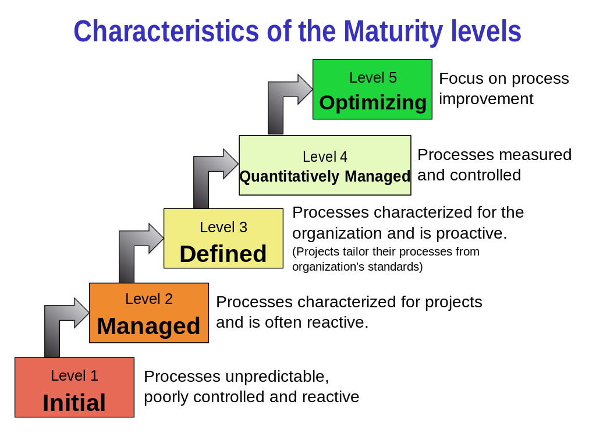


- **Total Quality Management (TQM)**

  - **Plan, Do, Check, Act**
  - *Improving quality is everyone's job --not just that of the QA department!*

  1. Quality can and must be managed.
  2. *Everyone* has a customer to delight.
  3. Processes, not the people, are the problem.
  4. *Every employee is responsible for quality.*
  5. Problems must be *prevented*, not just fixed.
  6. Quality must be *measured*, so it can be *controlled*.
  7. *Quality improvements must be continuous.*
  8. **Quality goals must be based on customer requirements.**


* **ISO 9001**
  * An international standard for quality assurance.
  * It specifies *how* to specify documents, and procedures that a company should follow in its quality control. It *does not* however, specify or require any *level of product quality*.


- **Bottom line:** things only get better when those involved...
  - ...have enough information to tell what's wrong
    - that's why you aim to take *quantitative measurements*
  - ...think about the process
    - nothing important, merely stating that you need to know that a thing called QA exists
  - ...plan how to improve
    - not only the specific product, but the whole process
  - ...actually make sure the plan happens
    - quality control
  - ...check whether it worked
    - quality control & quality imprvement

#### "Estimating"

- **Cost estimation**

  - Prior to any --significant-- project, you need to *estimate* how much it will *cost*.
    - Time cost, human resources cost, financial cost, ...
  - Many factors:
    - software size
    - software complexity
    - engineer productivity (individually and as a team)
  - **We'll consider only software size and complexity**
    - and define *Productivity is the ratio of these to time required.*

- **Lines of Code (LoC)**

  - [-] Not very meaningful by itself, what is a line of code?
  - [-] Does not make sense across different programming languages: imagine Haskell, Java, C...
  - [+] Still widely used! Alternatives like "function points" exist.


##### **Estimation approaches**
- **algorithmic cost modelling**
    develop (from past data) a model relating size/complexity to ultimate cost
- **expert consensus**
    get a bunch of expert estimates; compare, discuss, and repeat until convergence
- **analogy**
    relate the cost to that of similar completed projects
- ***what customer will pay***
    dangerous... 


- **COCOMO I**
  - [+] A long-standing algorithmic model, publicly available, well supported and widely used.
  - $$ \text{Effort} = \text{A} \times \text{Size}^\text{B} \times \text{M} $$
    - **Effort** is measured in person-months
    - **A** is a constant, dependent on kind of software *and* developing organisation
    - **B** typically range in $$1\ldots 1.5$$.
    - **M** is a *multiplier*. Product of 15 factors, each typically in range $0.9\ldots 1.4$, that are derived from ratings of attributes such as: *required reliability*, *required time to market*, *software engineer capability*, ...
  - [- ] Getting good values for **A**, **B**, and **M** is highly non-trivial.
    - [+] Considerable data available too.
  - Different versions, sub-models, tweaks available.

#### "Scheduling"

- **Why do projects almost always slip?**
  - *"People tend to be risk-averse when there is a potential of loss"*
  - *"People are unduly optimistic in their plans and forecasts"*
  - *"People prefer to use intuitive judgement rather than (quantitative) models"*


- **Gantt Charts**
  - Divide project into **tasks**, with **milestones** at the end.
  - Analyse dependencies between tasks.
  - Lay these tasks out as **bars running across time**, *respecting dependencies*.
  - The graph reveals the **critical path** of tasks for the project.
  - Optionally, show **permissible slippage** with shaded bars.
  - For example:
    - 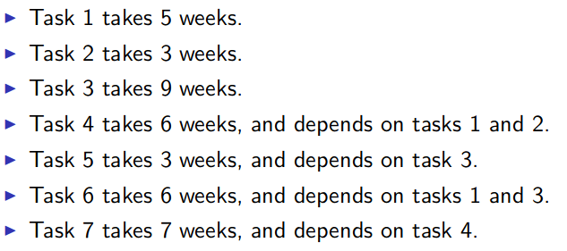
    - 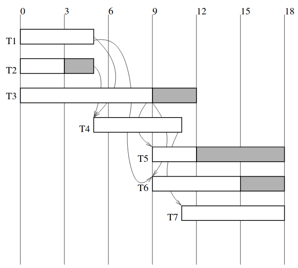


#### The Rest

- **Tracking**
  - A balance between too little and too much information to track.
    - One is insufficient, one is too much to process and manage!
- **Revising the Project Plan**
  - As the project goes on, estimates have to be revised in the light of progress, unforeseen problems, in other words, recent developments!

## 20 November 2018

### Non-Functional Requirements (NFR)

- **Concerns the whole system, not just the software**
- About
  - Ways the system needs to be related to other system and versions of itself:
    - flexibility
    - maintainability
    - reusability
    - portability
  - Properties of the system in use
    - usability
    - *dependability*
      - safety, reliability, availability, resilience
    - *efficiency*
      - *performance* (throughput, response time), resource usage
    - *security*
      - integrity, confidentiality
    - scalability
- NFRs must be identified along with functional requirements -- at the end is to late.
- **Often tied up with architectural decisions** which are almost impossible to modify later.
- It is essential to
  - **quantify the requirement**
  - **have ways to measure -- *metrics***

### Metrics

- Ideally, metrics are
  - **measurable**
    not based on "intuition" or "opinions" of someone
  - **specified with a precision**
    *i.e.* uncertainities must be recorded
  - **MEANINGFUL**
    numbers must have something to do with something we care about!

#### Reliability Metric

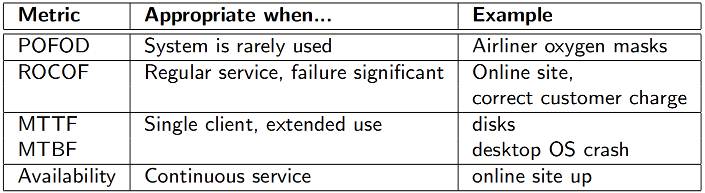

- **Reliability is a key non-function requirement in many systems.**
- **There are several ways to specify reliability requirements, depending on the nature of the system.**

##### POFOD - Probability of Failure on Demand

- POFOD is the probability that the system will fail when service is requested.
- **Mainly useful for systems that provide emergency or safety services.**
  - *e.g.* the emergency shutdown in a nuclear power plant will (hopefully) never be used -- but if it is, it should not fail!
- Can be evaluated through...
  - ...repeated tests in simulation.
    - which might be expensive.
  - ...static analysis of the whole system
    - which is definitely expensive, and to ensure that our analysis is correct, some real-world testing would be required.

##### ROCOF - Rate of Occurrence of Failure

- ROCOF is the number per unit time of failures (*i.e.* unexpected behaviour).
- **Time may mean *elapsed time*, *processing time*, *Number of Transactions*, *etc.***
- **Mainly used for systems providing regular service, where failure is significant.**
  - *e.g.* banking systems
    - VisaNet processes over 10^9^ transactions/day. Failure rate is not published, but probably (much) less than 10^-5^ failures/transaction.

##### MTTF & MTBF - Mean Time To/Between Failures

- **MTTF is used when system is non-repairable.**
  - *e.g.* often in the case of hardware
- **MTBF is used when system can recover from failures.**
  - *e.g.* operating system crashes
- **Both are mainly used where a single client uses the system *for a long time*.**
  - *e.g.* desktop PCs (and their components), *consumer products*

- **Keep in mind that *mean* alone is often insufficient to be decisive:**
  - Variation matters!
    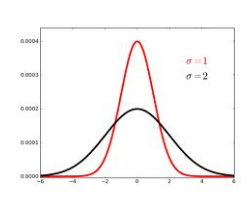
    - Whilst the component whose MTTF is shown with the red curve is more predictable to fail after MTTF whilst the blue curve indicates that the failure might occur much before (or much after) the MTTF.
    - *You would like your curve to be sharp & pointy.*

##### Availability

- Availability is the portion of the time that the system is "available for use".
- Often quoted as "five nines" (0.99999), "four nines", *etc.*
- **Appropriate for systems offering a *continuous service*, where clients expect it to be there all the time.**
- Often achieved by large data processing systems, such as mainframes.
- **The difference between availability and ROCOF** is that availability takes the time to recover from a failure into consideration too; *availability gives a better overall picture.*
  - For instance your ROCOF might be once in a year, but if it takes you 3 months to recover, that's not high availability.

### Usability

- We'll concern ourselves with User Interfaces (UI) only.
- *Most user errors are actually interface design failures.*


- **Human Limitations:** Humans...
  - ...have very limited short-term memory: 5-7 items.
  - ...make mistakes, especially under stress.
  - ...vary widely, capability-wise, preference-wise, and so on.
  - ...organise their perceived world differently!


#### Principles of UI Design
- **User familiarity**
  - The interface should "look familiar" to the users.
    - It should use concepts and *entities* (*e.g.* textboxes, buttons, sliders) from existing experience of the users.

- **Consistency**
  - Similar operations should be represented in similar ways.
    - *E.g.* Red always indicates a situation that requires caution, or to draw the user's attention; yellow indicates recoverable failure, ...
  - Consistency should be enforced (at least) across the application, but many "systems" (Android, iOS, ...) also enforce it across *all applications*.
    - Brands enforce their own consistency too! Microsoft and Google apps look alike across all the platforms.
  - *Beware that similarity might not always be well defined!*
- **Minimal surprise**
  - Avoid situations where the user will be surprised by the behaviour of the system.
  - Often is the case with *modal* applications where different keys have different effects in different modes.
- **Recoverability**
  - Allow the user to recover (easily) from errors.
  - *Reversibility* (*i.e.* being able to undo) is relevant here.
  - Checkpointing/autosaving is a valuable technique.
- **User guidance**
  - Kindly guide the user for taking the appropriate action through your UI.
    - As opposed to demanding them read 100 pages long manual.
  - Provide *meaningful* (*i.e.* actionable) error messages.
    - *E.g.* Bad: "File Save Error" Good: "File could not be saved because disk is full; open up some space and try again."
    - This is not always easy of course, there are tons of assumptions we make within our abstractions which --when violated-- does not yield a meaningful error message.
- **User diversity**
  - Remember that users vary on numerous levels on various axes.
    - Healthy, colour-blind, blind
    - Healthy, hearing-impaired, deaf
    - Fluent in English, intermediate, doesn't know English, or even illiterate!
    - Power users, casual users
  - Wherever possible, provide choices for *customisability*.
  - Often there are legal obligations about *accessibility*.

#### Task Analysis

1. What tasks users want to do with the system?
2. In what order and combination?


- *E.g.* Information should be presented wherever it is required.
  - AND to reduce the clutter, *information should not be represented wherever it is not required.*
- Running through user stories and use cases are often useful here.


#### User Interaction

- How do users interact with the system?


- **Direct manipulation**
  such as drag-and-drop
- **Menu selection**
  perhaps on a directly selected object
- **Form fill-in**
  typically used for data entry
- **Command language**
  typically used by traditional systems (UNIX)
- **Natural language**
  sometimes as a front end to a command language, but more advanced versions have emerged such as Siri, using NLP
- **Body language**
  such as Nintendo Wii, or XBox Kinect


#### Information Presentation

- How should information be presented to the user?
  - This has *nothing* to do with the way information is represented internally.

- Continuously varying information is best represented in an analogue representation (*i.e.* continuous graphs), not as numbers.
  - *Data visualisation*
- **Presentation should depend on the audience: *e.g.* graphs vs graphics.**


#### Colour
- Use few colours *consistently*, no more than four or five per context and no more than seven in total.
- Colour changes should signal something significant.
- Be careful about colour pairings (*e.g.* do not put red on blue background).
  - Contrast also affects accessibility; low contrast is harder to process visually (in general, but especially for the visually impaired).
- In general, vary colours along only one of the three dimensions (hue, saturation, brightness) to make a distinction.
- Know the output technology; primary green is often unreadable on screen but fine in print.
- Remember that around 10% of men are red-green colour-blind!

#### Interface design and evaluation
- Design iteratively.
- Only real end users are good judges of the interface; testing is important.
  - Evaluation is hard; get professionals, read HCI books.
- In expensive or critical software, involve professional from appropriate fields (*e.g.* ethnography).

## 22 November 2018

### Intellectual Property (IP)

> IP is not property, and it’s not intellectual.  It resists definition, but one definition of IP might be: *a monopoly right to exploit an intangible product of human thought or labour.*

Several broad categories:

- **copyright** applies to literary or artistic works
- **patents** apply to inventions of things or processes
- **design rights** apply to design of products
- *none of these were invented with software in mind...*

#### Patents

- Arose to protect *inventors* of physical objects or processes.
- **Stronger than copyright**
  - stops other people using/making object even if they invented it independently
- **Duration is sorter** -- 17 years
- **Software patents are controversial**
  - In U.S., yes; in Europe, no (roughly speaking).
  - In U.S., *business processes* are patentable (*e.g.* Amazon has patents on *one-click* shopping, and on the idea of customers reviewing products!).

#### Copyright

- Copyright protects *the expression of an idea*, not the idea itself.
  - *The original IP.*
- Restricts the ability to copy, adapt, *etc.* artistic or literary works.
- **Unlike patents, no merit [invention] is required; this document is a literary work for copyright purposes.**
- **Duration is longer** -- life of author + ~70 years.
- **The protected rights may be *assigned* in whole or in part, or *licensed* in whole or in part, with or without restrictions.**
- Source code is subject to copyright.
  - Object code and machine code are *adaptations or translations* of source code, hence protected.

- Clean-room reverse engineering is permissible under many jurisdictions.

#### Licenses

- Can be licensed per computer, per user, or per CPU cores!
- Sometimes it's the license to access and use a website.
  - *E.g.* Office 365
- Shareware/Fremimum, Free Open Source, Proprietary, ...
- GPL -- General Public License
  - **copyleft** -- modifications or adaptations of the work (including other works which depends on it) must be licensed under the same license.
  - As a result, *copyleft licenses are incompatible with each other*.
- LGPL -- Lesser General Public License
  - **weak copyleft** -- same as GPL, except other works which depends on our work does *not* have to be licensed under the same license.
  - Again, incompatible with other copyleft licenses.


Choosing a license may depend on:

- **philosophy**
  some consider restricting software to be unethical, some motivated by utilitarian views...
- **legal constraints**
  you may have used other software that restricts your choices (proprietary or copyleft).
- **business relevance**
  sharing the most valuable asset of your company might not be the best business strategy!
- **support**
  do you want your users to contribute?

## 27 November 2018

### Ethics

> Software engineers shall commit themselves to making the analysis, specification, design, development, testing and maintenance of software a *beneficial* and respected profession. In accordance with their commitment to the health, safety and welfare of the public, software engineers shall adhere to the following Eight Principles:
>
> 1. **PUBLIC** --- Software engineers shall act consistently with the public interest.
> 2. **CLIENT AND EMPLOYER** --- Software engineers shall act in a manner that is in the best interests of their client and employer consistent with the public interest.
> 3. **PRODUCT** --- Software engineers shall ensure that their products and related modifications meet the highest professional standards possible.
> 4. **JUDGEMENT** --- Software engineers shall maintain integrity and independence in their professional judgement.
> 5. **MANAGEMENT** --- Software engineering mangers and leaders shall subscribe to and promote an ethical approach to the management of software development and maintenance.
> 6. **PROFESSION** --- Software engineers shall advance the integrity and reputation of the profession consistent with the public interest.
> 7. **COLLEAGUES** --- Software engineers shall be fair to and supportive of their colleagues.
> 8. **SELF** --- Software engineers shall participate in lifelong learning regarding the practice of their profession and shall promote an ethical approach to the practice of the profession.

https://ethics.acm.org/code-of-ethics/software-engineering-code/

- **You should be able to answer, given an example, which codes of ethics the incident violates.**